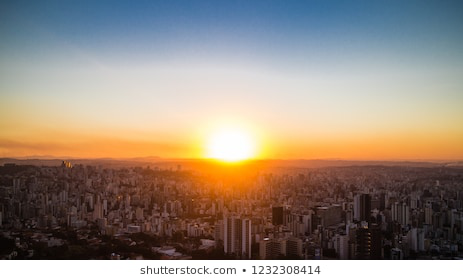
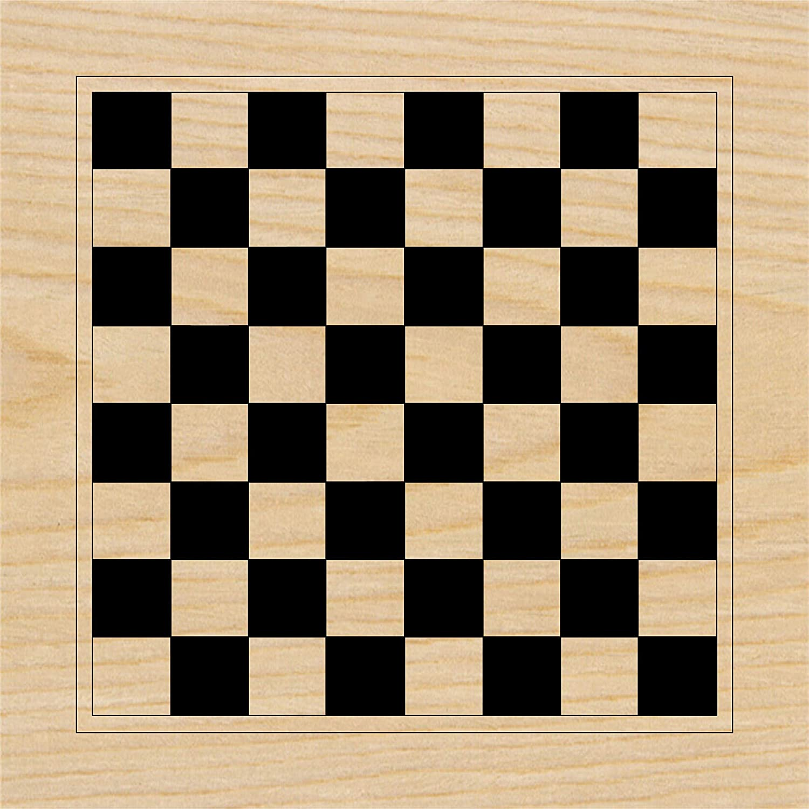
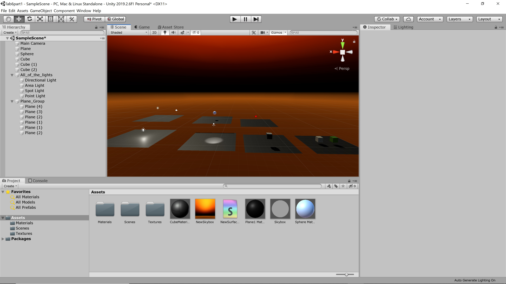
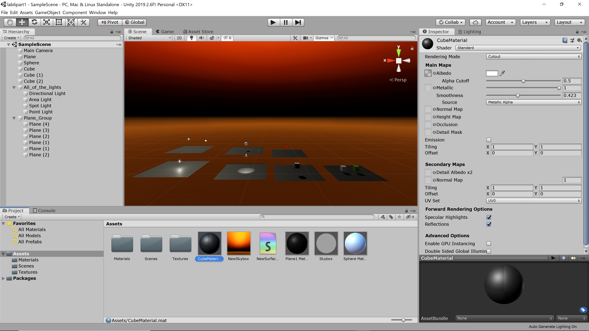

## CMPM163 Lab8

I just followed the tutorial to create the city. For the sun I created a sphere and changed its color to a color that looked like a sunrise.

Inspiration for my city

Picture of my city
https://drive.google.com/file/d/1_JzSLSTjkERsnSqQG5oFp-GhjZwA1QJ6/view?usp=sharing

What influenced the design of my city from the inspiration pic was definitely the sunrise. Sunrises are very aesthetically pleasing and are usually paired well with cities.

My partner Carlos Cisneros did part 1 of lab8 in unity. For the creative part he added new buildings, fog, and a sunset skybox. I thought it was super cool how he didn't have the buildings so close it made it look like an abandoned city. He didn't teach me anything from his picture. He did not help me with any part of this lab. 

## CMPM163 Lab7

I just followed the tutorials and edited the sphere to make the mountain.

Video of mountain and stream
https://drive.google.com/file/d/1NVvNpnecSfhCa7xaT3iz81zaiWMZXDn_/view?usp=sharing

My partner's response

I also did Part 1
The hardest part of the tutorial was getting the water tutorial to not render as purple sludge
I think that the way of linking the vertex shader to its position was the most interesting
He did not help me with the lab. 

## CMPM163 Lab6
I did part 1 for lab6

Light definitions
Point light: Sends light out in every direction
Spotlight: Sends light out in a cone 
Directional light:Sends light out in a certain direction that covers the whole scene
Area light: Sends light out in a rectangle

Material: 
I made the cube look like a checkerboad and I made that by creating a cube material and added "default checker grey" to the albedo.

Textures:
Right Cube = Grass
Left Cube = Dirt

These textures I found from the NatureStarterKit2 in the the Unity Asset Store

Skybox:
I created a new skybox and bumped up the sun settings to max. 

## CMPM163 Lab5
I did part both parts for lab 5 

For part 1's video 
https://drive.google.com/file/d/1LzD-KC_M3k2dnDvw13S6B2sf58eF3ygN/view?usp=sharing

You can play the game by opening "New Unity Project"

I modified multiple things. I changed the cart color to yellow, I added green particle effects from the tutorial too both sides of the cart, and I modified the entire course. I modified the course by getting rid of a couple curves and connecting the main course to the other part of the course. Me getting rid of some of the curves made it to where the course was longer but not as long as if you had just moved two curves. I also moved the check points, one being further away from the finish line and one being ontop of the the spiral area. 

Part 2 of the lab is below

Part2a https://drive.google.com/file/d/1Q-LIQaohrsHIlZyqJ6pbJR9uspDCjWbE/view?usp=sharing
Part2b https://drive.google.com/file/d/1eXDPsIf95CMIwrIhssYiXKkGt8C_v7LC/view?usp=sharing
Part2c https://drive.google.com/file/d/1iBzsqouDZ9Hrn3Nu4qBLrDhgYhEdTQ71/view?usp=sharing

I did part2a by following the tutorial
I did part2b by following the tutorial
I couldn't figure out how to change the particles so I instead made a rabbit sneezing green particles for fun. (which is part2c)

## CMPM163 Lab4
This is my video of my cubes 
https://drive.google.com/file/d/1icIsWHgoLJhjy6IPZL3xRRxKhHicI0QI/view?usp=sharing

From right to left
First cube is the part 2 tutorial. I haven't changed anything.
Second cube is the part 1 tutorial. I haven't changed anything. 
Middle cube is the part 1 tutorial. I haven't changed anything. 
Fourth cube is my part 1 cube with a different texture and normal map. 
Fifth cube I solved by googling and reading how to texture. 
(link to where I found it https://threejs.org/docs/#api/en/textures/Texture.repeat)

Answer for 24 

a. x = U*8
b. y = v*8
White

## CMPM163 Lab3
This is my video of my cubes
https://drive.google.com/file/d/1QuNkrYxinutHXIvRX715rc0E-7qvnoIy/view?usp=sharing
First cube is the part 1 tutorial cube. I haven't changed anything.
Middle cube is the part 1 cube that I made. I added an emmisive attribute that creates multiple shades of orange.
Right cube is the part 2 tutorial cube. I changed the colors to shades of pink. 

I was unable to finish the second half of part 2. 

## CMPM163 Lab2
https://drive.google.com/file/d/1dsjYOPhNx_OY7UCxOI9mHekXGIJ5qdkU/view?usp=sharing

